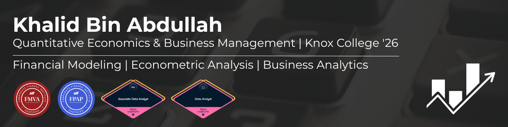

## 📊 Projects

### Excel: Financial Modeling
- **[Netflix DCF Valuation Model](https://github.com/khalidbabdullah/netflix-dcf-valuation)** - Built 3-statement financial model projecting 5-year revenue and cash flows, calculated WACC-based enterprise value, and performed two-way sensitivity analysis across discount rate and growth assumptions

### Tableau: Business Analytics
- **[Customer Churn Analysis](https://github.com/khalidbabdullah/customer-churn-analysis)** - Telecom dashboard analyzing 6,524 customers with 27.4% churn rate across contract types, payment methods, tenure, and service usage
- **[Healthcare Cost & LOS Analysis](https://github.com/khalidbabdullah/healthcare-cost-los-analysis)** - Hospital efficiency dashboard analyzing length of stay and cost patterns across 151 NY hospitals using LOD expressions

### R: Econometric Analysis
- **[U.S. Fiscal Policy SVAR Analysis](https://github.com/khalidbabdullah/fiscal-policy-svar-analysis)** - Measured government spending multipliers using cointegration testing (Johansen), structural VAR with bootstrap impulse responses, and structural break analysis on 20 years of quarterly GDP data
- **[Historical Crime & Agricultural Productivity](https://github.com/khalidbabdullah/historical-crime-agricultural-productivity)** - Fixed effects panel regression across 20 years examining lagged crime effects on agricultural output, controlling for income inequality and rainfall shocks using district-year observations
### Python: Financial Analysis
- **[S&P 500 vs. Macroeconomic Indicators](https://github.com/khalidbabdullah/sp500-macro-analysis)**
  \- Does the Fed actually drive the stock market? OLS regression across 100+ months of data says unemployment is the strongest predictor — not interest rates.
- **[Yield Curve Recession Indicator](https://github.com/khalidbabdullah/yield-curve-recession-indicator)**
  \- The yield curve has predicted every U.S. recession since 1955. This project tracks it, forecasts the next 6 months using ARIMA, and stress-tests three 2026 scenarios backed by JPMorgan and Schwab research.
- **[Monte Carlo Yield Curve Simulation](https://github.com/khalidbabdullah/monte-carlo-yield-curve-simulation)**
  \- 10,000 simulated futures. One question: how likely is the yield curve to invert again? The answer changes dramatically from 5.9% at 6 months to 20.5% at 24 months.
- **[GARCH Monte Carlo Yield Curve](https://github.com/khalidbabdullah/garch-monte-carlo-yield-curve)**
  \- Standard models assume constant volatility. Markets don't. GARCH captures volatility clustering to show near-term inversion risk is lower than average — but long-horizon risk is significantly higher.
- **[VAR Yield Curve Analysis](https://github.com/khalidbabdullah/var-yield-curve-analysis)**
  \- Does the Fed drive the yield curve or does the yield curve drive the Fed? 34 years of data say both — bidirectional Granger causality confirmed at p<0.05 with impulse response functions and variance decomposition.
- **[🔴 LIVE: Yield Curve Risk Monitor](https://yield-curve-monitor.streamlit.app)**
  \- Live dashboard pulling real-time FRED data, fitting GARCH(1,1), and running 10,000 Monte Carlo simulations to classify current inversion risk. Interactive stress testing across 6, 12, and 24-month horizons.
  
## 🛠️ Skills

### Languages & Tools

### Specializations

### Certifications

## 📄 Resume

## 💼 Let's Connect

---
🎯 Seeking Analyst opportunities in Chicago, New York, and Texas or remote.
