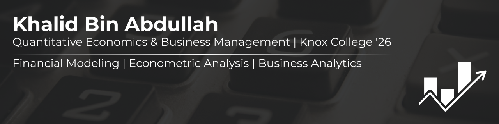

# Hi, I'm Khalid 👋
Recent Knox College graduate with a double major in Quantitative Economics 
and Business Management. I build financial models, analyze business data, 
and create visualizations that turn numbers into insights.

## 📊 Projects

### Excel: Financial Modeling
- **[Netflix DCF Valuation Model](https://github.com/khalidbabdullah/netflix-dcf-valuation)** 
  \- Discounted cash flow analysis with sensitivity tables and WACC calculations

### Tableau: Business Analytics
- **[Customer Churn Analysis](https://github.com/khalidbabdullah/customer-churn-analysis)** 
  \- Interactive dashboard analyzing telecom customer retention patterns across 4 dimensions

### R: Econometric Analysis
- **[U.S. Fiscal Policy SVAR Analysis](https://github.com/khalidbabdullah/fiscal-policy-svar-analysis)** 
  \- Time-series econometric study using VECM and SVAR models to measure fiscal multipliers
- **[Historical Crime & Agricultural Productivity](https://github.com/khalidbabdullah/historical-crime-agricultural-productivity)** 
  \- Panel data analysis examining crime, inequality, and agricultural output in Mandate Palestine (1926–1945)

### Python: Financial Analysis
- **[S&P 500 vs. Macroeconomic Indicators](https://github.com/khalidbabdullah/sp500-macro-analysis)** 
  \- OLS regression analysis testing whether Fed Funds Rate, CPI, and Unemployment 
  explain monthly S&P 500 returns using the FRED API

## 🛠️ Skills

### Languages & Tools

### Specializations

### Certifications

## 📄 Resume
[View My Resume (PDF)](https://github.com/khalidbabdullah/khalidbabdullah/blob/main/Khalid_Abdullah_Resume.pdf)

## 📫 Let's Connect
[LinkedIn](https://linkedin.com/in/khalidbabdullah)

---
💼 Seeking FP&A Analyst and Business Analyst opportunities in Chicago, Austin, or remote.
